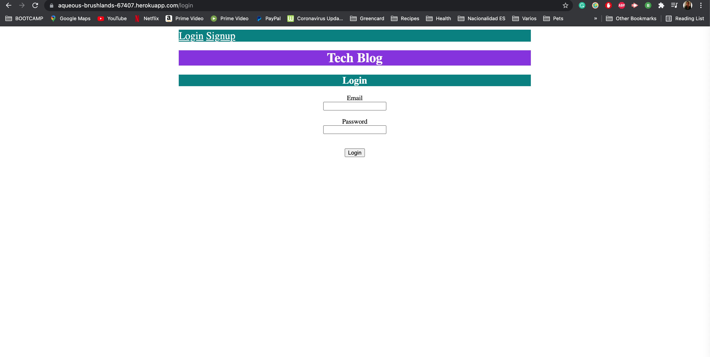
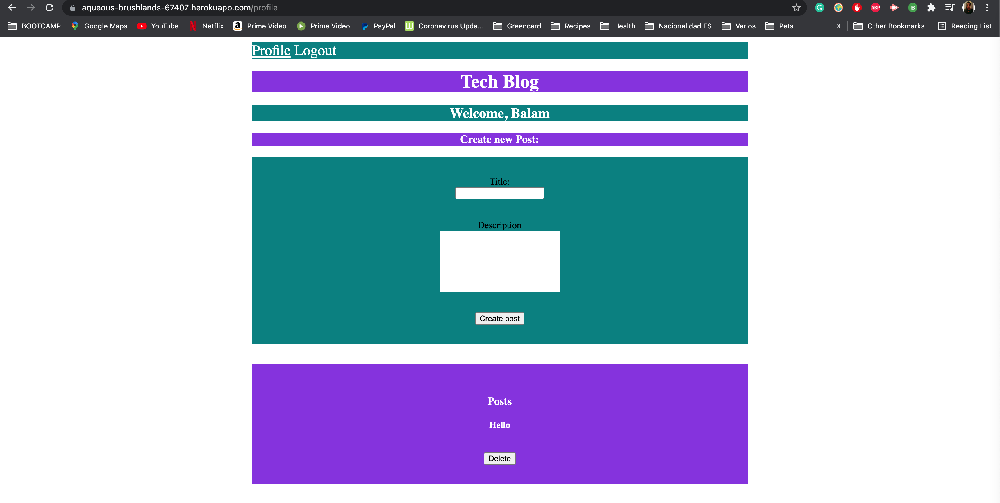
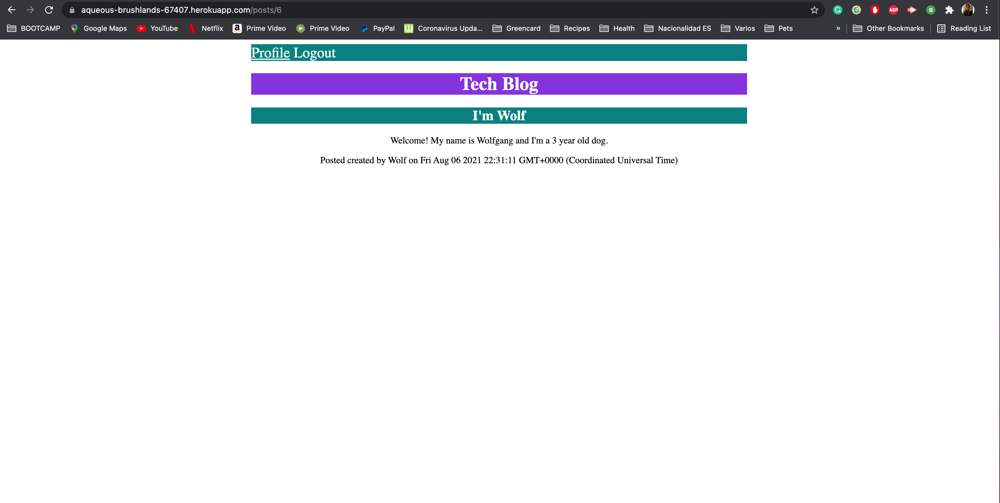

# Tech Blog

## Screenshot of Tech Blog

---
## Deployed link of the app

https://aqueous-brushlands-67407.herokuapp.com/

---
## My task

My task for this homework was to create an Tech Blog was to build a CMS-style blog site similar to a Wordpress site, where developers can publish their blog posts and comment on other developers’ posts as well. You’ll build this site completely from scratch and deploy it to Heroku. Your app will follow the MVC paradigm in its architectural structure, using Handlebars.js as the templating language, Sequelize as the ORM, and the express-session npm package for authentication.

All the files have been coded from scratch

---
### Created by Blenda Orellana
